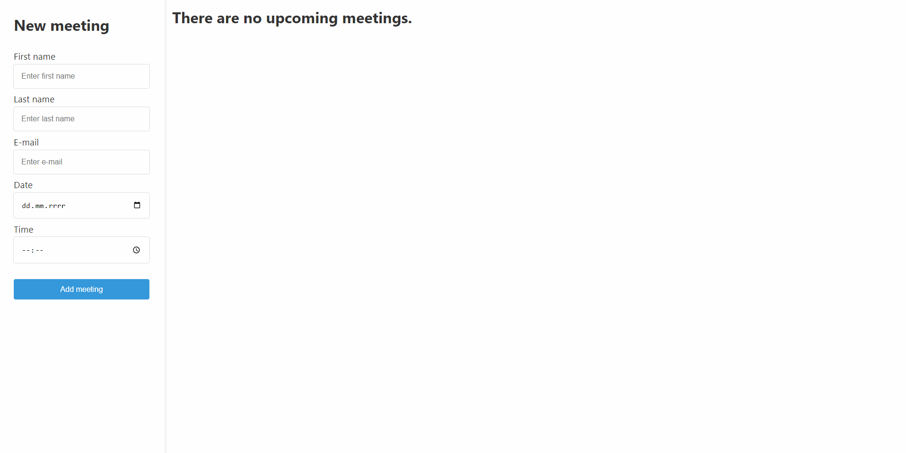

# Meetings calendar

This is a small application designed to save upcoming meetings.

**Main features**:
- **Meeting Creation:** Use the provided form to create new meetings. The form includes validation to ensure that all necessary information is provided and entered correctly.
- **Local Database:** The application utilizes a JSON-based database provided by json-server. All created meetings are saved in the local database.
- **Delete Meetings:** You can delete meeting from database. Simply select a meeting from the list and delete it with a remove button. The meeting will be permanently removed from the database.

&nbsp;
 
## 💡 Technologies

&nbsp;
 
## 🔗 See also

Are you interested in **React modern**? See my other project [KanbanApp](https://github.com/mikepatch/KanbanApp--React).

&nbsp;
  
## 💿 Installation

The project uses [node](https://nodejs.org/en/) and [npm](https://www.npmjs.com/). Having them installed, type into the terminal: `npm i`.

Run webpack

`npm start`

JSON Server

If you don't have installed JSON server on your computer, type in terminal:

`npm install -g json-server`

Then, you can run json-server using following command (from main folder):

`npm run db`
&nbsp;

## 🙋‍♂️ Feel free to contact me
Find me on...

 